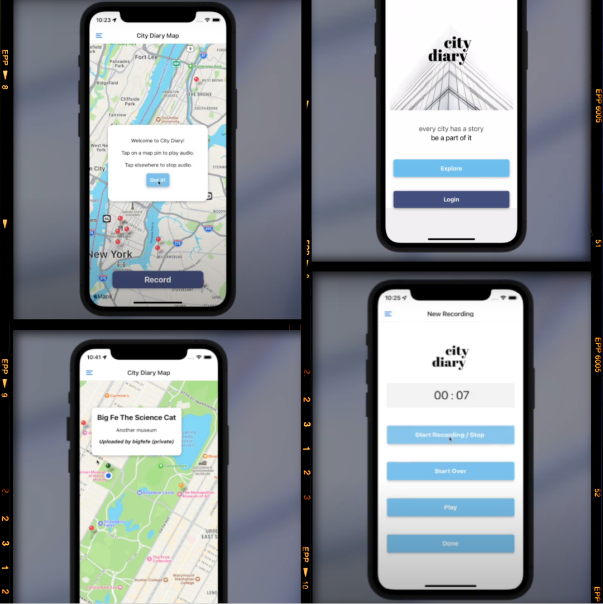

<p align="center">
  
  
</p>
<h3 align="center">
City Diary is a mobile app that allows you to interact with and explore<br>a user generated sound map.
</h3>


## Table of Contents

- [Introduction](#introduction)
- [Try out the latest version of City Diary](#try-out-the-latest-version-of-city-diary)
- [Tech Stack](#tech-stack)
- [Features](#features)
- [Future Goals](#future-goals)
- [Notes on Teamwork and Agile Software Development](#notes-on-teamwork-and-agile-software-development)
- [Developers](#developers)
- [Fork This Repo](#fork-this-repo)

## Introduction

City Diary is a mobile app that allows you to quickly capture audio, and save that unique moment to your specific location on a map. Users can choose to publicly or privately share their audio on the City Diary Map, to revisit anytime.

  As New Yorkers, we were inspired to help tell this city’s story through sound, highlighting the rich cultural diversity that changes with each step you take.  With City Diary, you can capture those precious fleeting moments like impromptu jazz in the park, buskers on the train platform, or the sound of your dear friend’s laughter after you land a great joke. 

Watch our demo video [here](https://www.youtube.com/watch?v=GZ4RHsHUgW8&list=PLx0iOsdUOUmmCV8l-qiwghVSCpL7kQiWJ&index=4)!

## Try out the latest version of City Diary

### Directions for Android Devices

- Scan the QR code displayed below
- Submit this [feedback form](https://forms.gle/VABCvZsQ9Viqz1t76) to let us know how your experience with City Diary was 😺

<p align="left">
  
</p>

### Directions for IOS Devices

- Download the [Expo Go app](https://apps.apple.com/us/app/expo-go/id982107779) from the App Store
- Create a free [Expo Go account](https://expo.dev/signup)
- Please fill out this [City Diary Invitation Request form](https://forms.gle/CpSBGEaUT8iQrYNw6) with the same email address used to create your Expo Go account
- We will add your Expo Go Account to our App. Please look out for an invitation email and kindly accept it. 
- Scan the QR code below to enjoy City Diary!
- Submit this [feedback form](https://forms.gle/VABCvZsQ9Viqz1t76) to let us know how your experience with City Diary was 😺

<p align="left">
  
</p>

## Tech Stack

- React Native
- Firebase (Cloud Storage, Firestore & Authentication)
- Expo

## Features

### App Features

<!-- - Persistent Login: Through Firebase Authentication -->
- ***Welcome Modal:*** Instructional pop up, overviewing how to interact with the City Diary Map
- ***Explore City Diary Map:*** As a visitor, or logged in user, you can listen to publicly shared audio on the City Diary Map
- ***Quick Recording Capability:*** As a registered user, you can quickly record audio with the touch of a button
- ***Instant Playback:*** Recorded audio clips can instantly be reviewed before saving and uploading
- ***Start Over Recording:*** Recorded audio clips can be reset and recorded again easily, all on one screen
- ***Recording Details Modal:*** Add a title and description to your audio to be displayed when audio marker is selected on the City Diary Map
- ***Public Upload:*** Registered users can choose to upload audio publicly to City Diary Map, displaying as a peach colored marker that will be available for visitors and other users to hear.
- ***Private Upload:*** Registered users can choose to upload audio privately to City Diary Map, that will ONLY display to them, when logged in, as a dark green colored marker.  Visitors and other users will not have access to listen or visibly see private markers on their City Diary Map view.
- ***Precisely Located Audio Markers:*** Registered user audio is uploaded to the City Diary Map using their precise location at time of recording


### Technical Features

- ***Registration:*** User login with E-mail & Password
- ***React Navigation:*** Drawer navigator & thoughtful Modal prompts to optimize user experience
- ***User data:*** Writing to & reading from Firestore Database
- ***Audio data:*** Recording & uploading sound file from user device to Cloud Storage. Retrieving sound file from Cloud Storage, and playing on user device
- ***Geolocation:*** Linking a sound file to precise location of user device at time of recording

## Future Goals

The next steps for City Diary include incorporating a user profile view that will display a list of all your audio files, along with audio file search and filter features.  Search and filter features will also be made available in the City Diary Map view.

## Notes on Teamwork and Agile Software Development

As a team, we learned valuable lessons from working together on an ambitious project with a strict deadline. 

- Fail fast, make mistakes quickly and learn from them
- Trust your teammates
- Communicate clearly, respectfully, and effectively
- Plan thoroughly
- Deploy early and often
- Practice good and consistent version control
- Have fun!!!

## Developers

Meet the team behind City Diary!

- Chenel Morgan - [Github](https://github.com/cheMorgan) | [LinkedIn](https://www.linkedin.com/in/chenelmorgan/)
- Heather White - [Github](https://github.com/HTHR-WHT) | [LinkedIn](https://www.linkedin.com/in/heather-white-nyc/)
- Jose Lema - [Github](https://github.com/mauilema) | [LinkedIn](https://www.linkedin.com/in/josemlema/)
- Malcolm Mack - [Github](https://github.com/malcolmlearnstech) | [LinkedIn](https://www.linkedin.com/in/malcolmrm/)

## Fork This Repo

Fork and clone this repo. Then, `npm install`.

Create a Firebase config file:

`mkdir src/firebase && touch src/firebase/fbConfig.js`

Add your Firebase configuration into `src/firebase/fbConfig.js`:

```
import * as firebase from 'firebase';
import '@firebase/auth';
import '@firebase/firestore';

const firebaseConfig = {
  apiKey: 'YOUR_KEY_HERE_AIzaSyAOWH',
  authDomain: 'your-auth-domain-b1234.firebaseapp.com',
  databaseURL: 'https://your-database-name.firebaseio.com',
  projectId: 'your-project-id-1234',
  storageBucket: 'your-project-id-1234.appspot.com',
  messagingSenderId: '12345-insert-yourse',
  appId: 'insert yours: 1:1234:web:ee873bd1234c0deb7eba61ce',
};
if (!firebase.apps.length) {
    firebase.initializeApp(firebaseConfig);
}
export { firebase }
```

Run `expo start`.

© 2022 GitHub, Inc.
Terms
Privacy
Security
Status
Docs
Contact GitHub
Pricing
API
Training
Blog
About
